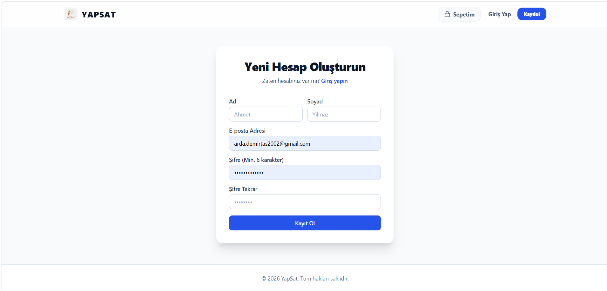
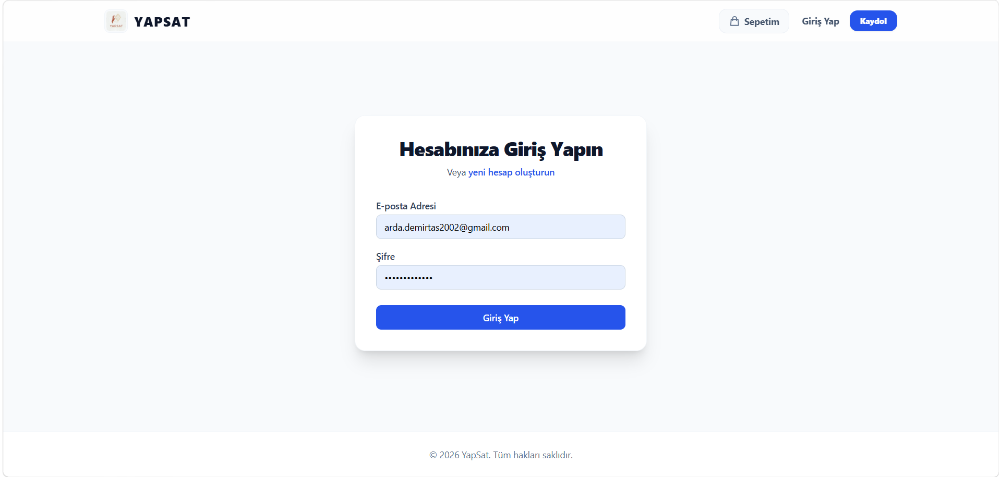
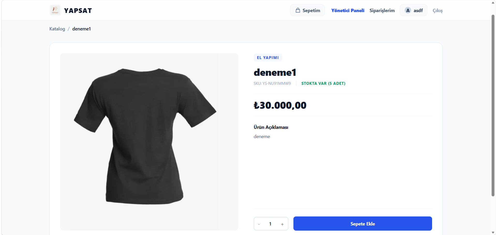
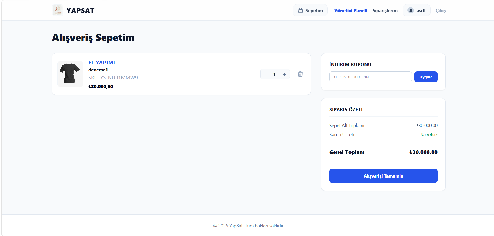
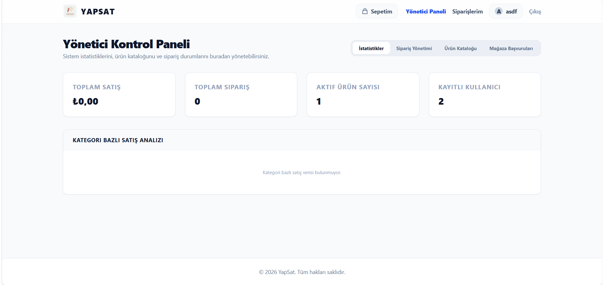
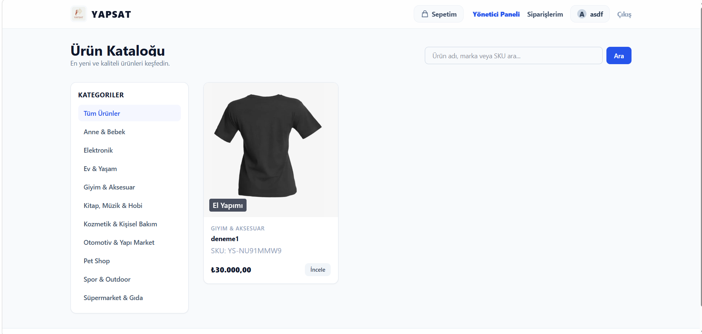

# YAPSAT - El Emeği Pazaryeri Platformu

YAPSAT, el yapımı ve özgün tasarım ürünlerin satışına odaklanan, modern, şık ve responsive tasarıma sahip çok satıcılı (multi-vendor) bir e-ticaret platformudur.

---

## 🚀 Teknolojik Altyapı (Tech Stack)

### Backend (Arka Ofis)
*   **Dil ve Framework:** Python 3.12, FastAPI
*   **Veri Tabanı & ORM:** SQLAlchemy 2.x, SQLite (Alembic Migrations ile)
*   **Kimlik Doğrulama:** JWT (JSON Web Tokens) ile güvenli session yönetimi
*   **Görsel Sunucu:** Cloudinary entegrasyonu (Medya dosyaları için)

### Frontend (Kullanıcı Arayüzü)
*   **Framework & Dil:** React 19, TypeScript
*   **Derleyici:** Vite
*   **Tasarım & Stil:** Tailwind CSS (Modern cam morfolojisi - Glassmorphism, yumuşak geçişler ve micro-animations ile)

---

## 💡 Öne Çıkan Özellikler ve Fonksiyonlar

1.  **Gelişmiş & Mobil Uyumlu Navbar:**
    *   Responsive hamburger menü tasarımı.
    *   Giriş yapan kullanıcının baş harflerinden oluşan şık avatar tasarımı.
    *   Admin ve Satıcı dashboard'larına dinamik erişim linkleri.
2.  **Otomatik Admin Atama:**
    *   Uygulama ayağa kalktığında `arda.demirtas2002@gmail.com` e-posta adresine sahip kullanıcı otomatik olarak en yüksek yetkili "ADMIN" statüsüne terfi ettirilir.
3.  **Akıllı Kategori Başlangıç Verisi (Seeder):**
    *   Veri tabanında kategori bulunmaması durumunda sunucu başlangıçta otomatik olarak 10 temel popüler kategoriyi (Elektronik, Ev & Yaşam, Giyim & Aksesuar, Kozmetik, Spor, Anne & Bebek, Kitap/Hobi, Süpermarket, Otomotiv, Pet Shop) otomatik olarak oluşturur.
4.  **İnteraktif Ürün Görsel Carousel:**
    *   Ürün detay sayfasında sol/sağ geçiş okları ve durum indikatör noktaları içeren, alt kısımda thumbnail (küçük resim) senkronizasyonuna sahip modern bir galeri kaydırıcısı.
5.  **Otomatik SEO Etiketleri:**
    *   Ürün ekleme veya güncelleme esnasında `seo_title` (`[Ürün Adı] - [Kategori] | YAPSAT`) ve `seo_description` (ürün açıklamasının ilk 150 karakteri) alanları sunucu tarafından otomatik olarak üretilir.
6.  **Otomatik Stok Kodu (SKU) Üretimi:**
    *   Manuel stok kodu girme zorunluluğu kaldırılmıştır. Kayıt esnasında sunucu otomatik olarak benzersiz `YS-XXXXXXXX` formatında kodlar üretir.
7.  **El Yapımı (Handmade) Seçim Kutusu:**
    *   Ürün eklerken Marka alanının yanındaki "El Yapımı" kutucuğu işaretlendiğinde marka ismi otomatik olarak "El Yapımı" olarak kilitlenir.
8.  **Çoklu Görsel Yükleme:**
    *   Ürün ekleme pencerelerinde doğrudan sürükle-bırak veya dosya seçimi ile çoklu görsel yükleme ve yükleme öncesi anlık önizleme grid yapısı.
9.  **Gelişmiş Bilgi Al Panelleri:**
    *   Yönetici ve Satıcı panellerinde ürün ekleme sayfalarının işleyişi hakkında kullanıcıya kılavuzluk eden interaktif rehber panelleri.


---

## 📸 Ekran Görüntüleri (Screenshots)

Aşağıda YAPSAT platformunun öne çıkan sayfalarına ait ekran görüntüleri yer almaktadır:

### 🔑 Üyelik Süreçleri
| Üye Kayıt Sayfası | Üye Giriş Sayfası |
|:---:|:---:|
|  |  |

### 🛍️ Alışveriş ve Sepet Süreçleri
| Ürün İnceleme & Detay (İnteraktif Carousel) | Alışveriş Sepeti |
|:---:|:---:|
|  |  |

### 💼 Yönetim ve Satıcı Dashboards
| Yönetici Ürün Yönetim Paneli | Satıcı & Mağaza Paneli |
|:---:|:---:|
|  |  |

---

## 🛠️ Kurulum ve Çalıştırma

### Gereksinimler
*   Node.js (v18+)
*   Python (v3.12+)

### 1. Backend Kurulumu
```bash
cd backend
# Sanal ortam oluşturun ve aktif edin
python -m venv .venv
.venv\Scripts\activate

# Bağımlılıkları yükleyin
pip install -r requirements.txt

# Veri tabanı şemasını güncelleyin
alembic upgrade head

# Sunucuyu başlatın
python -m uvicorn app.main:app --reload --port 8000
```

### 2. Frontend Kurulumu
```bash
cd frontend
# Bağımlılıkları yükleyin
npm install

# Geliştirme sunucusunu çalıştırın
npm run dev
```

---

## 📐 Mimari Tasarım (Backend Layers)

Proje, katmanlı mimari (Layered Architecture) prensiplerine göre yapılandırılmıştır:
```
API (Routes) ➔ Service (Business Logic) ➔ Repository (DB Queries) ➔ Database (Models)
```
*   **API Katmanı:** Sadece gelen istekleri doğrular ve yanıt modellerini döner. İş mantığı barındırmaz.
*   **Service Katmanı:** İş kurallarını (validasyonlar, stok kontrolleri, kupon doğrulama) yönetir.
*   **Repository Katmanı:** Veri tabanı okuma/yazma işlemlerini soyutlar.
